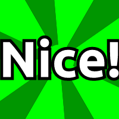

# 60frames

This will generate emojis of this style while allowing the user to select the background colors, text colors and text.

To use these in slack you will have to size them down appropriately using a separate online tool for now.  Search for `resize animated gif` in your favorite search engine.

LICENSING:
----
This code is licensed [MIT](./LICENSE)

Includes [p5.js](https://p5js.org/) which is licensed LGPL.

Includes [gif.js](http://jnordberg.github.io/gif.js/) which is licensed under [MIT](https://github.com/jnordberg/gif.js/blob/master/LICENSE).

Includes [Ubuntu font](https://design.ubuntu.com/font/) which is licensed under the [Ubunto font license](https://ubuntu.com/legal/font-licence)
